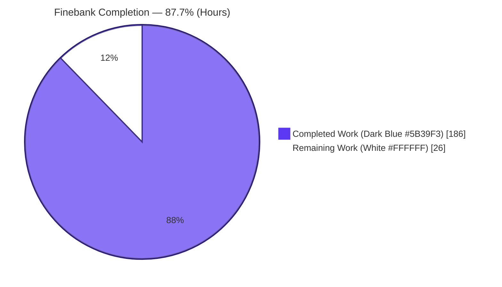
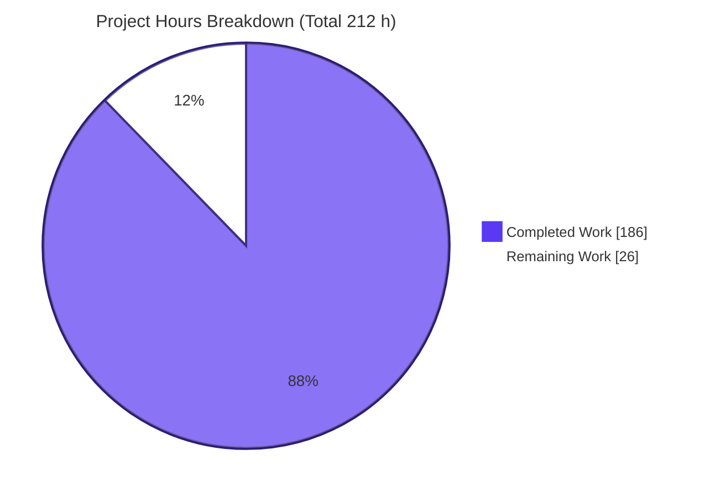
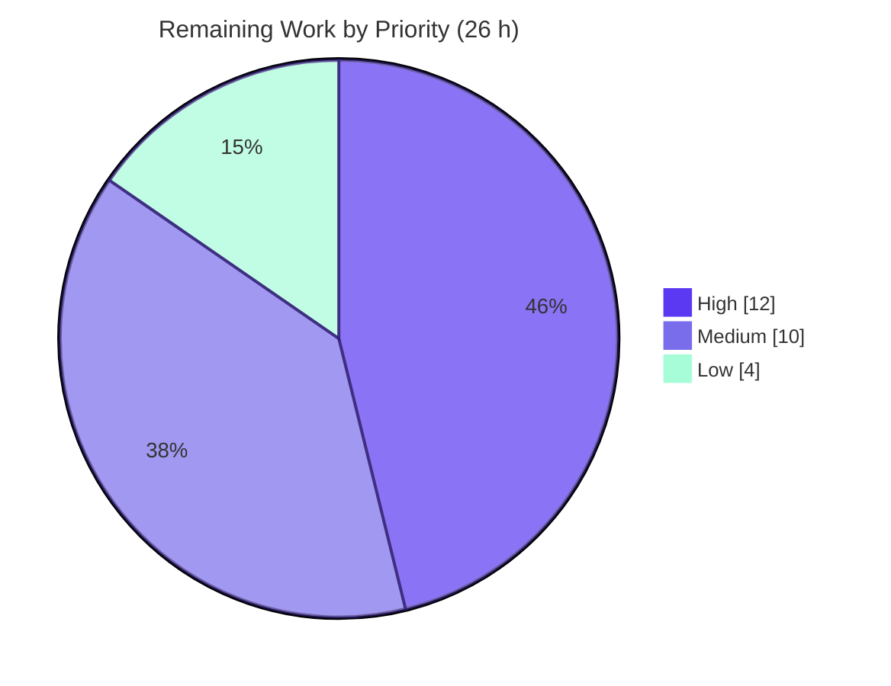

# Blitzy Project Guide — Finebank Institutional Finance Dashboard

> **Brand color legend** — Completed / AI Work: **Dark Blue `#5B39F3`** · Remaining / Not Completed: **White `#FFFFFF`** · Headings / Accents: Violet-Black `#B23AF2` · Highlight: Mint `#A8FDD9`.

---

## 1. Executive Summary

### 1.1 Project Overview

Finebank is a greenfield institutional finance/banking **portfolio-oversight dashboard** built with **Next.js 14 (App Router), TypeScript (strict), Tailwind CSS 3.4, and Recharts 2**. It reproduces a six-frame Figma design as **six independent routes** — Overview, Holdings, Cash & Collateral, Corporate Actions, Compliance, and Reporting — inside a single shared Sidebar + TopBar shell. Every figure is rendered from **static, typed local mock data** (no backend, API, or database) in a **monospace, tabular** typeface that preserves column alignment, with a deliberately **muted, institutional** aesthetic. It targets asset managers, custodians, and operations teams needing trustworthy, data-dense portfolio visibility. The build is **Vercel-ready** and ships with a self-contained reveal.js executive-summary deck for non-technical leadership.

### 1.2 Completion Status



| Metric | Value |
|--------|-------|
| **Total Hours** | **212 h** |
| **Completed Hours (AI + Manual)** | **186 h** (AI: 186 h · Manual: 0 h) |
| **Remaining Hours** | **26 h** |
| **Percent Complete** | **87.7%** (186 ÷ 212) |

> Completion is measured strictly on AAP-scoped deliverables plus standard path-to-production activities (PA1 hours methodology). Every AAP-specified code deliverable is complete and validated; the remaining 26 h is entirely path-to-production.

### 1.3 Key Accomplishments

- ✅ **Complete Next.js 14 scaffold** — pinned dependency set (13 packages, exact versions), `tsconfig` strict + `@/*` alias, `next.config.mjs` with security headers, `.nvmrc`/`engines` Node 20.x pin.
- ✅ **Six per-frame routes** created independently under `app/` — no tabs, no combined screens.
- ✅ **Single shared shell** (`app/layout.tsx` + `Sidebar` + `TopBar`) with `usePathname` active-state highlighting — zero chrome duplication.
- ✅ **Institutional design system** — Tailwind theme tokens + `next/font` (display + IBM Plex Mono), muted palette.
- ✅ **Monospace numerics** (`font-mono tabular-nums`) applied to every currency/percent surface (84 `font-mono` / 82 `tabular-nums` occurrences).
- ✅ **Recharts NAV chart** (`'use client'`) genuinely drawing a 12-period area series.
- ✅ **Static, typed data layer** — 9 datasets, 23 interfaces, 10 formatters; no `fetch`/API/DB/`lib/api`.
- ✅ **Quality gates green** — `tsc --noEmit` (0 errors), `next lint` (clean), `next build` (11/11 static pages).
- ✅ **Browser-verified runtime** — all 7 views PASS with zero console errors and zero failed network requests.
- ✅ **Mandated executive deck** — 16-slide self-contained reveal.js deck (Mermaid + Lucide, Blitzy brand, zero emoji).
- ✅ **Per-screen screenshots (F-007)** captured for all six routes.

### 1.4 Critical Unresolved Issues

There are **no code-level blockers** — the codebase compiles, lints, builds, and runs cleanly. The items below are **release-gating path-to-production activities** requiring human action/authority.

| Issue | Impact | Owner | ETA |
|-------|--------|-------|-----|
| Production deployment to Vercel not yet executed | Blocks go-live; configuration is ready but no live deploy exists | DevOps / Deploying engineer | ~0.5 day (4 h) |
| Figma per-frame visual fidelity not human-verified | Blocks formal design acceptance; Blitzy lacks authenticated Figma access | Design + Frontend reviewer | ~1 day (8 h) |
| Dependency security advisories not formally signed off | Blocks security gate; 5 high advisories accepted pending governance review | Security / Eng lead | ~0.25 day (2 h) |

### 1.5 Access Issues

| System/Resource | Type of Access | Issue Description | Resolution Status | Owner |
|-----------------|----------------|-------------------|-------------------|-------|
| Figma "Finebank" design file | Authenticated Figma API/editor seat | Frame contents are not programmatically extractable without authenticated access (AAP §0.10.2); pixel-fidelity verification requires a human with a Figma seat | Pending — human review | Design |
| Vercel project/account | Deploy credentials & project permissions | Production deployment requires Vercel account access; not available to the autonomous agent | Pending — human action | DevOps |
| Git repository | Commit/push access | No issue — all 16 build commits authored by `Blitzy Agent <agent@blitzy.com>`; branch clean | Resolved | — |

### 1.6 Recommended Next Steps

1. **[High]** Execute the Vercel production deploy and verify all six routes + the `/`→`/overview` redirect and security headers on the live URL (4 h).
2. **[High]** Perform the Figma per-frame fidelity sign-off across all six screens, reconciling the three under-specified frames (Cash & Collateral, Corporate Actions, Reporting) (8 h).
3. **[Medium]** Formally review and accept the five dependency advisories (documented rationale: unused features + Next 14 pin) and set a Next-14 upgrade-watch (2 h).
4. **[Medium]** Run responsive/cross-browser QA and a WCAG 2.1 AA accessibility audit sign-off (8 h combined).
5. **[Low]** Add a CI pipeline (Node 20 `npm ci` + `tsc` + `lint` + `build` on PRs) to guard against regressions (3 h).

---

## 2. Project Hours Breakdown

### 2.1 Completed Work Detail

| Component | Hours | Description |
|-----------|------:|-------------|
| Scaffold & Toolchain Configuration | 10 | `package.json` (exact pins + `engines`), `package-lock.json`, `tsconfig` (strict + `@/*`), `next.config.mjs` (+ security headers), `next-env.d.ts`, `.eslintrc.json`, `.gitignore`, `.nvmrc`; version-line research/pinning (§0.2.2, §0.4). |
| Institutional Design System | 14 | `tailwind.config.ts` theme tokens (palette/spacing/radius/shadow/`fontFamily`) derived from Figma, `app/globals.css`, and `next/font` wiring for display + IBM Plex Mono faces (§0.5). |
| Data, Types & Formatting Layer | 20 | `lib/types.ts` (23 interfaces), `lib/mock-data.ts` (9 typed datasets for all 6 screens), `lib/format.ts` (10 formatters w/ edge handling), `lib/nav.ts` (6-section config) (§0.7.1). |
| Application Shell | 18 | `app/layout.tsx` shell + `Sidebar.tsx` (`'use client'`, `usePathname` active state, responsive, a11y) + `TopBar.tsx` — single non-duplicated chrome (F-005). |
| Core Presentational Components | 30 | `KpiCard`, `HoldingsTable`, `NavChart` (Recharts, no-data state, tooltip), `AlertsPanel`, `FigureText` (F-001–F-004, F-006). |
| Section Data Tables | 20 | `CashBalancesTable`, `CollateralTable`, `CorporateActionsTable`, `ReportsTable` to render the three under-specified frames (consistent with §0.7.1). |
| Route Pages (6 screens + landing) | 26 | `app/page.tsx` (`redirect('/overview')`) + six per-frame `page.tsx` composing components with mock data (§0.7.1). |
| README & Developer Documentation | 4 | `README.md` update: Getting Started, Screens map, Project Structure, Architecture, Deployment. |
| Executive Presentation Deck | 16 | `blitzy-deck/executive-summary.html` — 16 slides, 2 Mermaid diagrams, Lucide icons, inline Blitzy theme, CDN pins (Rule §0.8.1). |
| Autonomous Validation, QA Fixes & Screenshots | 28 | Multiple review/fix cycles (23-finding shell a11y, 12-finding review, numeric typography, security headers, NavChart tooltip, `/` redirect header, deck Mermaid timing) + `tsc`/`lint`/`build` gates + browser runtime validation + F-007 screenshots. |
| **Total Completed** | **186** | **Matches Section 1.2 Completed Hours** |

### 2.2 Remaining Work Detail

| Category | Hours | Priority |
|----------|------:|----------|
| Vercel Deployment & Verification | 4 | High |
| Figma Visual Fidelity Sign-off | 8 | High |
| Responsive & Cross-Browser QA | 4 | Medium |
| Accessibility (WCAG 2.1 AA) Audit | 4 | Medium |
| Dependency Security Advisory Governance | 2 | Medium |
| CI Pipeline Setup (lint/typecheck/build gate) | 3 | Low |
| Executive Deck Stakeholder Review | 1 | Low |
| **Total Remaining** | **26** | **Matches Section 1.2 Remaining Hours & Section 7 pie** |

### 2.3 Total Project Hours & Completion Calculation

```
Completed Hours (§2.1)      = 186 h
Remaining Hours (§2.2)      =  26 h
------------------------------------
Total Project Hours         = 212 h   (186 + 26)
Completion %                = 186 / 212 = 87.74%  ≈  87.7%
```

Cross-checks: §2.1 total (186) = §1.2 Completed · §2.2 total (26) = §1.2 Remaining = §7 "Remaining Work" · §2.1 + §2.2 = 212 = §1.2 Total.

---

## 3. Test Results

> **Integrity note:** This project has **no automated unit/integration test suite** — and none was requested. Per AAP §0.2.1/§0.3.2 the mandated acceptance posture is **per-screen visual comparison**. Accordingly, the rows below are **Blitzy's autonomous validation checks** (static analysis, build, runtime, and browser verification) drawn **exclusively from Blitzy's autonomous validation logs** for this project — independently re-run and confirmed. "Coverage %" is **N/A** because no code-coverage instrumentation exists (no unit suite by design).

| Test Category | Framework | Total Tests | Passed | Failed | Coverage % | Notes |
|---------------|-----------|------------:|-------:|-------:|:----------:|-------|
| Static Analysis (Type Safety) | TypeScript 5.9.3 — `tsc --noEmit` (strict) | 23 | 23 | 0 | N/A | Zero type errors across all in-scope `.ts/.tsx` (~5,686 LOC). |
| Lint / Code Quality | ESLint 8.57.1 — `next lint` (core-web-vitals) | 23 | 23 | 0 | N/A | "No ESLint warnings or errors". |
| Production Build | Next.js 14.2.35 — `next build` | 11 | 11 | 0 | N/A | "Compiled successfully"; 11/11 static pages generated. |
| Runtime Smoke (HTTP) | `curl` against `next start` | 8 | 8 | 0 | N/A | `/`→307 `/overview`; six routes→200; unknown→404; security headers present. |
| Browser Runtime / UI | Headless Chrome (subagent) | 7 | 7 | 0 | N/A | All 7 views PASS; zero console errors; zero failed network requests; NAV chart drawn; monospace verified. |
| Executive Deck Render | Headless Chrome (subagent) | 16 | 16 | 0 | N/A | 16 slides render; 2 Mermaid SVGs + 24 Lucide icons; 31/31 requests 200. |
| **Total** | — | **88** | **88** | **0** | **N/A** | **100% of autonomous validation checks pass.** |

---

## 4. Runtime Validation & UI Verification

**Environment:** Node 20.20.2 / npm 10.8.2 · `next start` production server · independently verified via `curl` and headless Chrome.

**Server & routing health**
- ✅ **Operational** — `/` returns **307** with `Location: /overview` (server-side + client-side).
- ✅ **Operational** — `/overview`, `/holdings`, `/cash-collateral`, `/corporate-actions`, `/compliance`, `/reporting` all return **200**.
- ✅ **Operational** — unknown route returns **404** (`_not-found`).
- ✅ **Operational** — Security headers on every response: `Content-Security-Policy` (`default-src 'self'`; `frame-ancestors 'none'`; `object-src 'none'`; `base-uri 'self'`; `form-action 'self'`), `X-Frame-Options: DENY`, `X-Content-Type-Options: nosniff`, `Referrer-Policy: strict-origin-when-cross-origin`; `X-Powered-By` suppressed.

**UI verification (headless Chrome — PASS on all 7 views)**
- ✅ **Shared shell** — persistent Sidebar (6 links, correct order/hrefs) + TopBar are **structurally identical** across all routes; only `aria-current="page"` differs, confirming a single shared shell (not duplicated).
- ✅ **Active highlight** — tracks the current route on every navigation (exactly one active item per route).
- ✅ **Overview** — 4 KPI cards (AUM **$468.2M**, Daily P&L **+$6.3M ▲ +1.4%**, YTD **+13.6%**, Risk **Moderate / VaR 2.1%**); Recharts NAV **area chart genuinely drawn** (1 `<svg>`, 2 `<path>` with real coordinate geometry, d-lengths 918 & 521 — not an empty box); Alerts panel present.
- ✅ **Holdings** — semantic 8-column × 8-row data-dense table; six numeric columns **right-aligned** in **IBM Plex Mono + `tabular-nums`**; **directional coloring** (gains green `rgb(21,119,74)`, losses red `rgb(178,59,59)`, neutral muted).
- ✅ **Cash & Collateral / Corporate Actions / Compliance / Reporting** — each renders its **own distinct content** (summary KPIs + section tables / full alerts surface) within the shared shell.
- ✅ **Diagnostics** — **zero** console errors/warnings and **zero** failed network requests across all 7 views (38 preserved requests, all 2xx/3xx, same-origin; strict CSP blocked nothing).
- ✅ **Monospace font confirmed** — numeric cells resolve to `IBM Plex Mono` (self-hosted via `next/font`) with `font-variant-numeric: tabular-nums`.
- ✅ **Evidence** — 7 full-page route screenshots + 16 deck-slide screenshots + 2 screen recordings saved under `blitzy/`.

_No partial (⚠) or failing (❌) items were observed._

---

## 5. Compliance & Quality Review

AAP deliverables and hard constraints cross-mapped to Blitzy quality/compliance benchmarks. Fixes applied during autonomous validation are noted.

| Benchmark / AAP Requirement | Status | Evidence / Fixes Applied |
|-----------------------------|:------:|--------------------------|
| One route per Figma screen (no tabs) | ✅ Pass | Six route dirs under `app/`; slugs match `lib/nav.ts`. |
| Shared layout — no chrome duplication | ✅ Pass | `Sidebar`+`TopBar` rendered once in `app/layout.tsx`; browser-confirmed identical shell. Fix cycle resolved 23 shell/a11y findings. |
| Tailwind CSS only (no CSS-in-JS/MUI/etc.) | ✅ Pass | No forbidden styling deps in `package.json`; Tailwind tokens + utilities only. |
| Static mock data only (no `fetch`/API/DB) | ✅ Pass | No `app/api`, no `lib/api`, no DB client; the 8 `fetch` mentions are all in comments. |
| Recharts for NAV visualization | ✅ Pass | `components/NavChart.tsx` (`'use client'`) imports `recharts`; chart drawn at runtime. Fix aligned tooltip to Y-axis compact notation. |
| Monospace numerics (`font-mono tabular-nums`) | ✅ Pass | 84 `font-mono` / 82 `tabular-nums` occurrences; browser-confirmed IBM Plex Mono. Fix cycle corrected numeric typography. |
| Institutional muted aesthetic | ✅ Pass | Muted token palette; browser-reviewed data-dense professional layout. |
| Node pinned 20.x (no auto-upgrade) | ✅ Pass | `.nvmrc`=`20`; `engines.node`="20.x"; validated under Node 20.20.2. |
| Exact dependency pins (§0.4) | ✅ Pass | All 13 packages match exactly; `npm ci` deterministic (lockfile unchanged). |
| TypeScript strict + lint clean | ✅ Pass | `tsc --noEmit` 0 errors; `next lint` clean. Fix cycle resolved 12 review findings. |
| Vercel-ready (no Dockerfile/custom server) | ✅ Pass | Minimal `next.config.mjs`; standard `next build`. Security headers added (QA #5–#8). |
| Executive deck (Rule §0.8.1) | ✅ Pass | 16 slides, exact CDN pins, Mermaid+Lucide, brand palette, zero emoji. Fix resolved Mermaid render-timing. |
| Per-screen screenshots (F-007) | ✅ Pass | 7 route screenshots captured. **Outstanding:** human Figma acceptance (HT-2). |
| `/` redirect emits `Location` header | ✅ Pass | Forced-dynamic redirect; browser-confirmed 307 → `/overview`. Fix FG-02. |
| Dependency security advisories | ⚠ Accepted | 5 high advisories accepted (unused features; fix violates Next 14 pin). **Outstanding:** formal governance sign-off (HT-5). |
| Accessibility (semantic HTML/ARIA/keyboard) | ⚠ Implemented | `aria-current`, landmarks, keyboard nav present. **Outstanding:** formal WCAG audit sign-off (HT-4). |

---

## 6. Risk Assessment

| Risk | Category | Severity | Probability | Mitigation | Status |
|------|----------|:--------:|:-----------:|------------|--------|
| Five high `npm audit` advisories (Next.js SSR/Server-Actions/rewrites + PostCSS build-time) | Security | High (nominal) / Low (effective) | Very Low | Affected features unused by static app → nil runtime exposure; the only fix (`next@16`) violates the AAP Next-14 pin; document risk acceptance + Next-14 upgrade-watch | Accepted — pending human sign-off (HT-5) |
| Figma per-frame fidelity asserted but not human-verified; 3 frames under-specified | Technical | Medium | Medium | Human sign-off with authenticated Figma access; reconcile under-specified frames | Open (path-to-prod, HT-2) |
| No automated regression test suite | Technical | Low | Medium | Out of AAP scope by design; add CI + component/visual tests before feature growth | Accepted (HT-6) |
| Extra components beyond the six AAP-named | Technical | Low | Low | Consistent with §0.7.1; compile/lint clean; documented | Resolved / Accepted |
| CSP allows `'unsafe-inline'` (script/style) | Security | Low–Medium | Low | Acceptable for Next hydration + Tailwind; adopt nonce-based CSP if stricter hardening required | Accepted |
| No auth layer | Security | N/A | N/A | By design — UI-only, no secrets/PII, static mock data | N/A by design |
| Production deploy not yet executed | Operational | Medium | High | Execute Vercel deploy + verify live | Open (path-to-prod, HT-1) |
| No monitoring/observability | Operational | Low | Low | Static app; optional Vercel Analytics | Accepted |
| No CI regression gate | Operational | Low | Medium | Add GitHub Actions (Node 20: `npm ci`+`tsc`+`lint`+`build`) | Open (HT-6) |
| No external integrations | Integration | N/A | N/A | By design — no API/DB/`fetch` this phase | N/A by design |
| Deck depends on 3 CDNs at view time | Integration | Low | Low | Pins fixed & verified 200; vendor locally for offline use | Accepted |
| Node must stay pinned at 20.x (sandbox default is 22) | Integration | Low–Medium | Medium | `.nvmrc` + `engines` pin; guide documents `nvm use 20` | Mitigated |

---

## 7. Visual Project Status

**Project hours — completed vs remaining** (Completed = Dark Blue `#5B39F3`, Remaining = White `#FFFFFF`):



**Remaining work — priority distribution** (High 12 h · Medium 10 h · Low 4 h = 26 h):



**Remaining hours by category** (sums to 26 h — matches §1.2 Remaining and §2.2 total):

| Category | Hours | Priority |
|----------|------:|----------|
| Figma Visual Fidelity Sign-off | 8 | High |
| Vercel Deployment & Verification | 4 | High |
| Responsive & Cross-Browser QA | 4 | Medium |
| Accessibility (WCAG) Audit | 4 | Medium |
| CI Pipeline Setup | 3 | Low |
| Dependency Security Governance | 2 | Medium |
| Executive Deck Stakeholder Review | 1 | Low |
| **Total** | **26** | — |

> **Integrity:** "Remaining Work" = **26 h** in the pie chart equals the §1.2 Remaining Hours and the §2.2 Hours-column sum.

---

## 8. Summary & Recommendations

**Achievements.** Finebank is a **fully implemented, greenfield Next.js 14 dashboard** that honors every AAP hard constraint: six independent per-frame routes, a single non-duplicated Sidebar+TopBar shell, Tailwind-only styling, static typed mock data (no backend), monospace tabular numerics, a Recharts NAV chart, an institutional muted aesthetic, a Node-20 pin, and the mandated self-contained reveal.js executive deck. All quality gates are green (`tsc` strict, `next lint`, `next build` 11/11 pages) and independent headless-Chrome verification returned **PASS on all seven views** with zero console errors and zero failed network requests.

**Remaining gaps.** No unfinished AAP code remains. The outstanding **26 hours are exclusively path-to-production**: executing the Vercel deploy, obtaining a human Figma fidelity sign-off (Blitzy lacks authenticated Figma access), responsive/cross-browser and accessibility audits, formal acceptance of the five dependency advisories, an optional CI pipeline, and a stakeholder review of the deck.

**Critical path to production.** (1) Deploy to Vercel and verify the live routes/redirect/headers → (2) complete the Figma fidelity sign-off and reconcile the three under-specified frames → (3) sign off the security-advisory acceptance → (4) run responsive/cross-browser + WCAG audits → (5) add CI.

**Success metrics.** 13/13 dependency pins exact · 0 type errors · 0 lint findings · 11/11 pages built · 7/7 routes PASS in-browser · 88/88 autonomous validation checks pass · deck 16/16 slides render.

**Production-readiness assessment.** The application is **code-complete and production-ready for the AAP UI-only scope** at **87.7% overall completion (186 of 212 hours)**. The one nominally-High risk (five `npm audit` advisories) has effectively nil runtime exposure for this static app and is correctly accepted because remediation would violate the mandatory Next 14 pin. With the ~26 hours of path-to-production sign-offs and the live deploy, the project is ready for launch.

| Metric | Value |
|--------|-------|
| Overall completion | 87.7% (186 / 212 h) |
| AAP code deliverables complete | 100% (all files present, validated) |
| Quality gates | tsc ✅ · lint ✅ · build ✅ |
| Autonomous validation checks | 88 / 88 pass |
| Remaining (path-to-production) | 26 h |

---

## 9. Development Guide

> All commands below were executed and verified under **Node 20.20.2 / npm 10.8.2**.

### 9.1 System Prerequisites
- **Node.js 20.x LTS** (pinned — **do not** use Node 22; the sandbox default is 22, so switch explicitly).
- **npm 10.x**, **git**, and any modern browser (for the executive deck).
- ~500 MB free disk for `node_modules`.

### 9.2 Environment Setup (Node 20 via nvm)
```bash
export NVM_DIR="$HOME/.nvm"
. "$NVM_DIR/nvm.sh"
nvm install 20      # first time only
nvm use 20
hash -r
node --version      # -> v20.20.2
npm --version       # -> 10.8.2
```
> **No environment variables / `.env` are required** — the app is static and stateless (no secrets, API keys, or datastore).

### 9.3 Dependency Installation
```bash
npm ci               # deterministic install from package-lock.json (recommended)
# or: npm install
```
Expected: exit 0, ~427 packages, **lockfile unchanged**.

### 9.4 Application Startup
```bash
# Development (hot reload)
npm run dev          # -> http://localhost:3000  ("/" auto-redirects to /overview)

# Production
npm run build        # "✓ Compiled successfully", 11/11 static pages
npm start            # -> http://localhost:3000

# Custom port
npm run dev -- -p 3001
```

### 9.5 Verification Steps
```bash
# Type safety (expect exit 0)
npx tsc --noEmit

# Lint (expect: "✔ No ESLint warnings or errors")
npm run lint

# Runtime smoke (with the server running)
curl -sI http://localhost:3000/            # HTTP/1.1 307 ; Location: /overview
curl -s -o /dev/null -w "%{http_code}\n" http://localhost:3000/overview   # 200
```
Open the executive deck:
```bash
# Self-contained; needs internet for CDN libs (reveal.js/Mermaid/Lucide)
open blitzy-deck/executive-summary.html      # macOS
# xdg-open blitzy-deck/executive-summary.html # Linux
```

### 9.6 Example Usage
- Navigate the sidebar across the six sections; transitions are client-side (no full reload).
- **Overview** → four KPI cards + a Recharts NAV chart + a recent-alerts panel.
- **Holdings** → a data-dense 8-column table with right-aligned monospace numerics and green/red directional coloring.
- **Cash & Collateral / Corporate Actions / Reporting** → summary KPIs + section-specific tables. **Compliance** → the full alerts surface.

### 9.7 Troubleshooting
- **Node 22 is active / `engines` warning** → run `nvm use 20` (the `engines` field enforces 20.x).
- **Port 3000 in use** → append `-- -p 3001` to `dev`/`start`.
- **`next start` fails with "Could not find a production build"** → run `npm run build` first (a prior `next dev` overwrites `.next` with a dev build).
- **`npm audit` reports 5 high advisories** → **expected & accepted**. **Do NOT run `npm audit fix --force`** — it installs `next@16` (a breaking change that violates the AAP Next 14 pin). See Risk Assessment / HT-5.
- **Deck shows no diagrams/icons** → ensure internet access for CDN libraries; check the browser console.
- **Deployment** → push to Vercel; Next.js is auto-detected — no `Dockerfile` or custom server needed.

---

## 10. Appendices

### A. Command Reference
| Command | Purpose |
|---------|---------|
| `nvm use 20` | Activate the pinned Node 20 runtime |
| `npm ci` | Deterministic dependency install |
| `npm run dev` | Start dev server (`:3000`) |
| `npm run build` | Production build (11 static pages) |
| `npm start` | Start production server (`:3000`) |
| `npm run lint` | ESLint (`next lint`) |
| `npx tsc --noEmit` | TypeScript strict typecheck |

### B. Port Reference
| Port | Service | Notes |
|------|---------|-------|
| 3000 | Next.js dev/prod server | Default; override with `-- -p <port>` |

### C. Key File Locations
| Path | Role |
|------|------|
| `app/layout.tsx` | Root shell — `next/font` + `Sidebar` + `TopBar` |
| `app/page.tsx` | Landing — `redirect('/overview')` |
| `app/<section>/page.tsx` | Six per-frame route pages |
| `components/` | 6 core + 5 supporting presentational components |
| `lib/types.ts` · `lib/mock-data.ts` · `lib/format.ts` · `lib/nav.ts` | Types · static data · formatters · nav config |
| `tailwind.config.ts` · `app/globals.css` | Design tokens · base styles |
| `next.config.mjs` | Minimal config + security headers |
| `blitzy-deck/executive-summary.html` | Self-contained reveal.js deck |
| `blitzy/screenshots/` · `blitzy/screen_recordings/` | Validation artifacts (untracked) |

### D. Technology Versions
| Package | Version |
|---------|---------|
| next | 14.2.35 |
| react / react-dom | 18.3.1 |
| recharts | 2.15.4 |
| typescript | 5.9.3 |
| tailwindcss | 3.4.19 |
| postcss | 8.5.21 |
| autoprefixer | 10.5.4 |
| eslint / eslint-config-next | 8.57.1 / 14.2.35 |
| @types/node / @types/react / @types/react-dom | 20.19.43 / 18.3.31 / 18.3.7 |
| Node.js / npm (runtime) | 20.x LTS / 10.x |
| reveal.js / Mermaid / Lucide (deck CDN) | 5.1.0 / 11.4.0 / 0.460.0 |

### E. Environment Variable Reference
**None required.** The application is static and stateless — no secrets, API keys, datastore, or `.env` files. The only runtime "configuration" is the pinned Node version (`.nvmrc` / `engines`).

### F. Developer Tools Guide
| Tool | Use |
|------|-----|
| nvm | Pin/activate Node 20.x |
| TypeScript (strict) | Compile-time type safety (`tsc --noEmit`) |
| ESLint (`next/core-web-vitals`) | Lint & best-practices |
| Tailwind CSS + PostCSS + Autoprefixer | Utility-first styling pipeline |
| Recharts | NAV/performance chart rendering |
| Headless Chrome | Runtime/UI verification & screenshots |

### G. Glossary
| Term | Definition |
|------|------------|
| AAP | Agent Action Plan — the authoritative project directive |
| NAV | Net Asset Value — the portfolio value time series charted on Overview |
| KPI | Key Performance Indicator — AUM, P&L, YTD return, risk cards |
| VaR | Value at Risk — risk metric shown on the Overview KPI |
| Shell | The shared Sidebar + TopBar chrome in `app/layout.tsx` |
| RSC | React Server Component — default render mode for pages/layout |
| Path-to-production | Standard activities (deploy, sign-offs, CI) to take validated code live |
| F-007 | Per-screen screenshot deliverable requirement |
